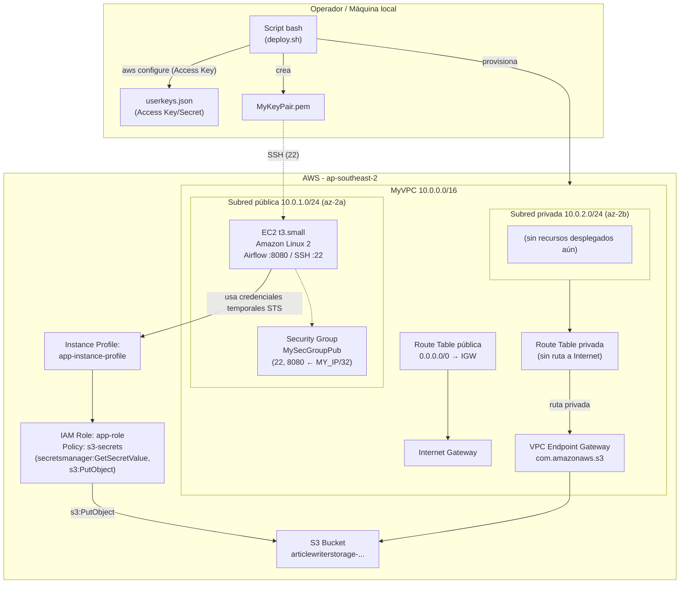

# Arquitectura — Cloud Architecture ETL

## Diagrama

*(Reemplazable por un diagrama en un visor Mermaid o por una imagen exportada; refleja 1:1 los recursos creados por el script adjunto.)*

## Componentes

| Componente local | Equivalente cloud | Identidad / credencial |
|---|---|---|
| Usuario/operador ejecutando el script | Consola AWS / API AWS | Access Key + Secret Key estáticos leídos de `userkeys.json` (usuario IAM) |
| Servidor de cómputo local (host de la ETL) | Instancia EC2 `t3.small` (Amazon Linux 2), lanzada vía Launch Template | Rol IAM `app-role` asumido a través del Instance Profile `app-instance-profile` (credenciales temporales STS, sin claves estáticas en la instancia) |
| Acceso SSH con clave local | EC2 Key Pair `MyKeyPair` (.pem) | Clave privada descargada localmente en cada ejecución (se borra y regenera cada vez) |
| Almacenamiento de archivos local | Bucket S3 `articlewriterstorage-...` | Acceso mediado por la policy `s3-secrets` adjunta a `app-role` (escritura vía `PutObject`) |
| Red interna / firewall local | VPC `MyVPC` (10.0.0.0/16) con subred pública (10.0.1.0/24) y privada (10.0.2.0/24) | N/A (segmentación de red) |
| Firewall de host | Security Group `MySecGroupPub` | Reglas de ingreso limitadas a la IP pública actual del operador (`MY_IP/32`), puertos 22 (SSH) y 8080 (Airflow) |
| Salida a Internet | Internet Gateway + Route Table pública | N/A |
| Acceso a servicios AWS desde red privada sin salir a Internet | VPC Endpoint tipo *Gateway* hacia S3, asociado a la Route Table privada | Gobernado por policies IAM y la policy del propio endpoint (si se define) |
| Orquestador de la ETL (ej. Airflow) | Corre dentro de la instancia EC2, expuesto en el puerto 8080 | Hereda la identidad del rol de instancia `app-role` |

## Puntos únicos de falla identificados

| SPOF | Mitigación en cloud |
|---|---|
| Una sola instancia EC2, sin Auto Scaling ni redundancia | Desplegar en un Auto Scaling Group multi-AZ detrás de un Load Balancer; usar `t3.small` como mínimo, con health checks |
| Subred pública y AZ únicas (`ap-southeast-2a`) | Duplicar subredes públicas/privadas en al menos 2 AZ (ej. `ap-southeast-2a` y `ap-southeast-2b`) |
| Claves de acceso estáticas (`userkeys.json`) usadas para todo el aprovisionamiento y almacenadas en disco local | Reemplazar por roles IAM asumibles con STS (AssumeRole / SSO), evitar Access Keys de larga duración y, si son imprescindibles, rotarlas periódicamente con `aws iam rotate-access-key` o similar |
| Autenticación SSH basada únicamente en archivo `.pem` local | Usar AWS Systems Manager Session Manager (sin necesidad de puerto 22 abierto ni clave privada) |
| Bucket S3 en una sola región, sin réplica | Habilitar Cross-Region Replication (CRR) o versioning + backup a otra región |
| Regla de Security Group atada a la IP pública dinámica del operador (`MY_IP`) | Usar un bastion host / VPN corporativa, o reglas más estables gestionadas por IaC, en vez de whitelisting manual de IP |
| Aprovisionamiento manual vía script bash, sin estado ni idempotencia garantizada por una herramienta de IaC | Migrar a Terraform/CloudFormation con backend de estado remoto (ej. S3 + DynamoDB lock) |
| Subred privada sin NAT Gateway (solo VPC Endpoint a S3) | Si se necesitan otros servicios AWS o Internet desde la subred privada, agregar NAT Gateway redundante por AZ o endpoints de interfaz adicionales |

## Decisiones de identidad

**Cómo se autentican los servicios entre sí**
La instancia EC2 no usa claves estáticas: se le asigna el rol IAM `app-role` mediante el Instance Profile `app-instance-profile`. AWS entrega credenciales temporales por el Instance Metadata Service (IMDS), que el SDK/CLI dentro de la instancia consume automáticamente para llamar a S3 y otros servicios. Las Access Keys de `userkeys.json` solo se usan en la máquina del operador para el aprovisionamiento inicial (crear VPC, EC2, IAM, etc.), no las usa la aplicación en runtime.

**Quién/qué puede acceder a qué recurso**
- `app-role` tiene adjunta la policy `s3-secrets` (definida en `permissions.json`), que le concede `secretsmanager:GetSecretValue` sobre el secreto `article_writer_secrets` y `s3:PutObject` sobre el bucket `articlewriterstorage-...`. Es decir, la instancia EC2 puede escribir objetos nuevos en el bucket, pero no leerlos, listarlos ni administrar otros recursos.
- El Security Group `MySecGroupPub` limita el acceso de red entrante solo a la IP pública del operador en el momento de la ejecución, en los puertos 22 y 8080.
- La subred privada no tiene ruta a Internet (sin NAT Gateway); el único camino de salida hacia AWS es el VPC Endpoint Gateway hacia S3, lo que evita exponer ese tráfico a Internet.

**Cómo se rotan las credenciales**
- El Key Pair EC2 (`MyKeyPair.pem`) se elimina y se regenera en cada ejecución del script (`aws ec2 delete-key-pair` seguido de `create-key-pair`), por lo que cada despliegue usa una clave SSH nueva.
- Las credenciales del rol de instancia (`app-role`) son temporales y AWS las rota automáticamente vía STS sin intervención manual.
- Las Access Keys estáticas de `userkeys.json` **no se rotan** en este script — es el punto más débil de la arquitectura desde el punto de vista de identidad; se recomienda automatizar su rotación o eliminarlas en favor de roles asumibles / AWS SSO para el propio flujo de aprovisionamiento.